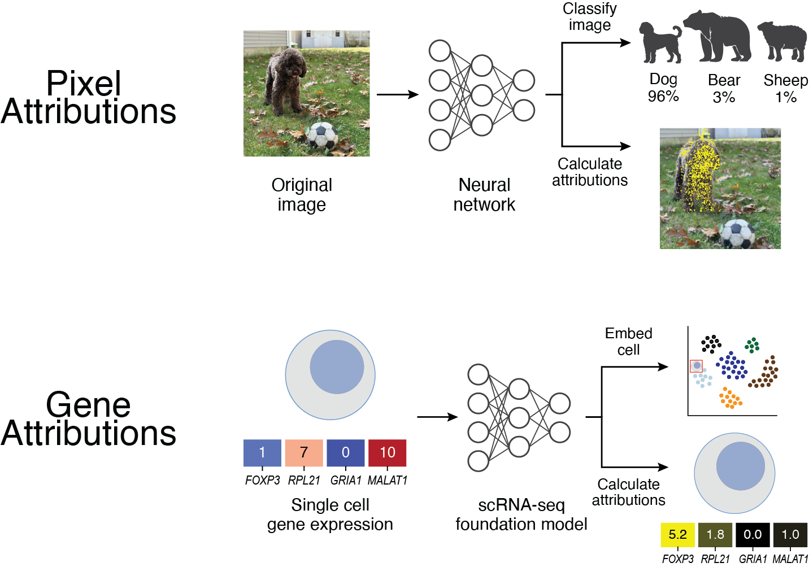
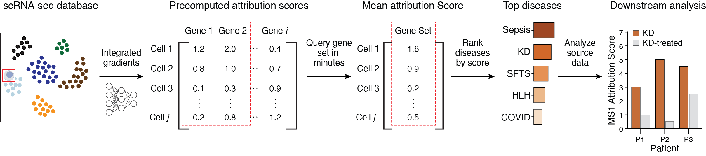
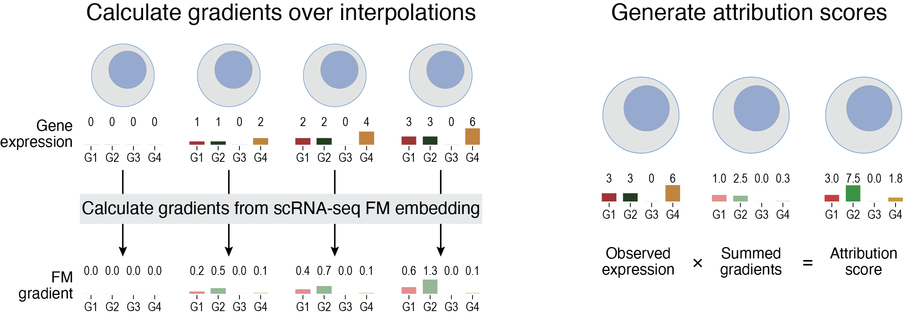

SIGnature
================================================================================

.. toctree::
    :maxdepth: 1
    :hidden:

    Overview <self>
    Installation <install>
    Tutorials <tutorials>
    API Reference <api>
    Release Notes <news>
    About <about>

Scoring the Importance of Genes using scRNA-seq Foundation Models
--------------------------------------------------------------------------------

SIGnature is a python package that enables the efficient generation and 
collection of gene attributions.

Attribution scores can be used for rapid gene signature scoring across database
of 22 million single cell transcriptomes.

Capabilities
--------------------------------------------------------------------------------

Query Attributions
^^^^^^^^^^^^^^^^^^^^^^^^^^^^^^^^^^^^^^^^^^^^^^^^^^^^^^^^^^^^^^^^^^^^^^^^^^^^^^^^

:mod:`signature.signature` provides tools to query attributions across dozens of cell types from hundreds of studies.

Generate attributions
^^^^^^^^^^^^^^^^^^^^^^^^^^^^^^^^^^^^^^^^^^^^^^^^^^^^^^^^^^^^^^^^^^^^^^^^^^^^^^^^

:mod:`signature.signature` also provides tools to generate attribution scores on new data that can be integrated with out existing scores.

Indices
--------------------------------------------------------------------------------

| :ref:`genindex`
| :ref:`modindex`
