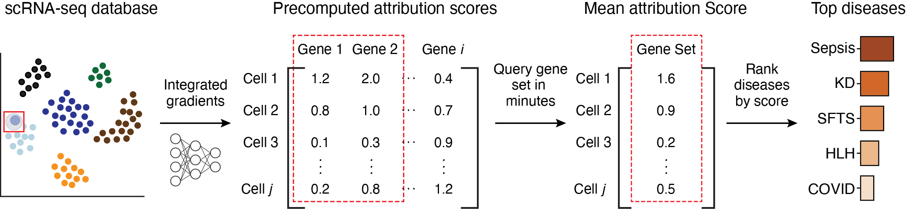

SIGnature
================================================================================

.. toctree::
    :maxdepth: 1
    :hidden:

    Overview <self>
    Installation <install>
    Tutorials <tutorials>
    API Reference <api>
    Release Notes <news>
    About <about>

Scoring the Importance of Genes using scRNA-seq Foundation Models
--------------------------------------------------------------------------------

**SIGnature** is a Python package that empowers researchers to rapidly query gene sets across diverse single-cell RNA sequencing (scRNA-seq) datasets through precomputed gene attribution scores.

Beyond querying capabilities, SIGnature also enables the generation of attribution scores on novel scRNA-seq data, allowing seamless integration with our collection of annotated studies.

Capabilities
--------------------------------------------------------------------------------

Query Attributions
^^^^^^^^^^^^^^^^^^^^^^^^^^^^^^^^^^^^^^^^^^^^^^^^^^^^^^^^^^^^^^^^^^^^^^^^^^^^^^^^

:mod:`signature.signature` provides tools to query attributions across dozens of cell types from hundreds of studies.

Generate attributions
^^^^^^^^^^^^^^^^^^^^^^^^^^^^^^^^^^^^^^^^^^^^^^^^^^^^^^^^^^^^^^^^^^^^^^^^^^^^^^^^

:mod:`signature.signature` also provides tools to generate attribution scores on new data that can be integrated with our collection of annotated datasets.

Indices
--------------------------------------------------------------------------------

| :ref:`genindex`
| :ref:`modindex`
